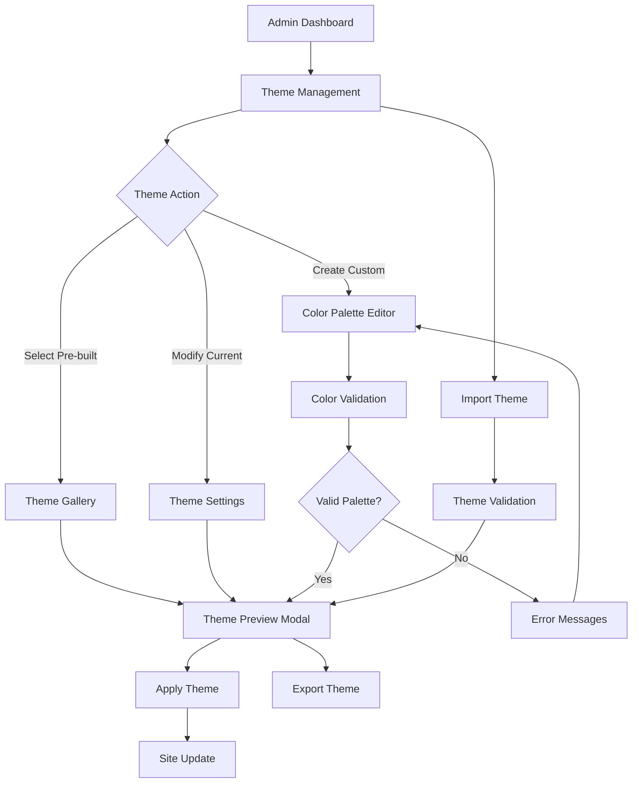

# Antler CMS Theming System - Product Requirements Document

## 1. Product Overview

The Antler CMS Theming System provides a comprehensive solution for customizing the visual appearance of websites built with Antler CMS. Users can select from pre-built theme options or create custom color palettes through an intuitive admin interface, while maintaining full light/dark mode functionality across all themes.

- **Primary Goal**: Enable non-technical users to customize their site's visual identity through a user-friendly admin interface
- **Target Users**: Content creators, small business owners, and developers who want quick theme customization without coding
- **Market Value**: Reduces development time and provides professional-looking design options out of the box

## 2. Core Features

### 2.1 User Roles

| Role | Access Method | Core Permissions |
|------|---------------|------------------|
| Site Administrator | Admin login credentials | Full theme management, custom palette creation, theme preview |
| Content Editor | Limited admin access | Theme selection from pre-built options only |

### 2.2 Feature Module

Our theming system consists of the following main pages and components:

1. **Theme Management Page**: Theme selection gallery, custom palette editor, preview functionality
2. **Theme Preview Modal**: Real-time theme preview, component showcase, before/after comparison
3. **Color Palette Editor**: Color picker interface, palette validation, accessibility checker
4. **Theme Settings Panel**: Light/dark mode configuration, typography options, component styling preferences

### 2.3 Page Details

| Page Name | Module Name | Feature Description |
|-----------|-------------|---------------------|
| Theme Management | Theme Gallery | Display pre-built themes in grid layout with preview thumbnails. Allow one-click theme application. |
| Theme Management | Custom Palette Editor | Provide color picker tools for primary, secondary, accent colors. Include color harmony suggestions. |
| Theme Management | Active Theme Display | Show currently applied theme with quick edit options and reset functionality. |
| Theme Preview | Live Preview Modal | Real-time preview of theme changes across different page types (home, blog, project pages). |
| Theme Preview | Component Showcase | Display how theme affects buttons, cards, navigation, forms, and typography. |
| Theme Settings | Light/Dark Configuration | Customize light and dark mode variations for selected theme. Toggle between modes in preview. |
| Theme Settings | Typography Options | Select font pairings, sizing scales, and text styling that complement chosen colors. |
| Theme Settings | Export/Import | Export theme configurations as JSON files. Import custom themes from files. |

## 3. Core Process

### Administrator Theme Management Flow
1. Administrator accesses Theme Management from admin dashboard
2. Views current active theme and available pre-built options
3. Selects new theme from gallery OR creates custom palette using color editor
4. Previews theme changes across different page types using preview modal
5. Configures light/dark mode variations and typography settings
6. Applies theme changes site-wide with confirmation dialog
7. Can export theme configuration for backup or sharing

### Content Editor Theme Selection Flow
1. Content Editor accesses limited Theme Management interface
2. Views and selects from approved pre-built theme options only
3. Previews selected theme using simplified preview modal
4. Applies chosen theme with administrator approval (if required)

## 4. User Interface Design

### 4.1 Design Style

**Color System Architecture:**
- Primary colors: Main brand colors (5 shades each for light/dark modes)
- Secondary colors: Supporting colors for accents and highlights
- Neutral colors: Grays and backgrounds (10 shade scale)
- Semantic colors: Success, warning, error, info states

**Component Styling:**
- Rounded corners: 8px default, 12px for cards, 6px for buttons
- Shadows: Subtle elevation system (4 levels: none, sm, md, lg)
- Typography: Inter font family with 5 weight variations (300, 400, 500, 600, 700)
- Spacing: 8px base unit with consistent scale (4, 8, 12, 16, 24, 32, 48, 64px)

**Theme Transition Effects:**
- Smooth color transitions: 300ms ease-in-out for all color changes
- Theme switching animation: 200ms fade effect during theme application
- Preview animations: Instant updates with subtle highlight effects

### 4.2 Page Design Overview

| Page Name | Module Name | UI Elements |
|-----------|-------------|-------------|
| Theme Management | Theme Gallery | Grid layout (3 columns desktop, 2 tablet, 1 mobile). Each theme card shows preview thumbnail, theme name, color swatches. Hover effects reveal "Apply" and "Preview" buttons. |
| Theme Management | Custom Palette Editor | Split layout: color picker tools on left, live preview on right. Color input fields with hex/RGB values. Harmony suggestions below main colors. Save/reset buttons at bottom. |
| Theme Management | Active Theme Panel | Compact card showing current theme name, primary colors, last modified date. Quick edit button and theme export option. |
| Theme Preview | Preview Modal | Full-screen modal with tabbed interface (Home, Blog, Projects, Admin). Close button top-right. Apply/Cancel buttons bottom-right. Theme name display top-left. |
| Theme Settings | Configuration Panel | Accordion-style sections for Light Mode, Dark Mode, Typography. Toggle switches for mode preferences. Dropdown selectors for font options. |

### 4.3 Responsiveness

**Desktop-First Approach:**
- Primary design optimized for desktop admin interface (1200px+ screens)
- Tablet adaptation: Simplified grid layouts, larger touch targets (768px-1199px)
- Mobile optimization: Single-column layouts, collapsible sections, thumb-friendly controls (320px-767px)

**Touch Interaction:**
- All interactive elements minimum 44px touch target
- Swipe gestures for theme gallery navigation on mobile
- Long-press for additional options on theme cards
- Pinch-to-zoom disabled on color picker interfaces for precision