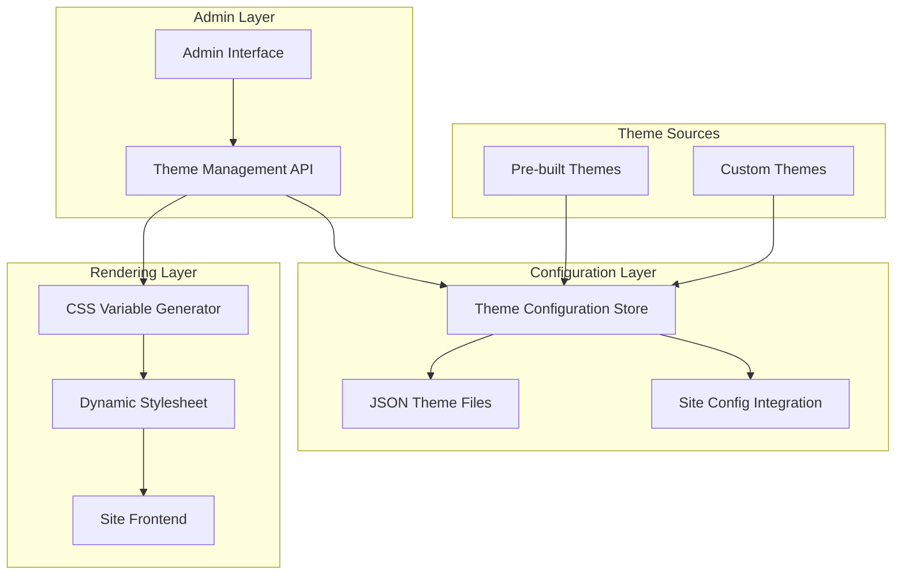
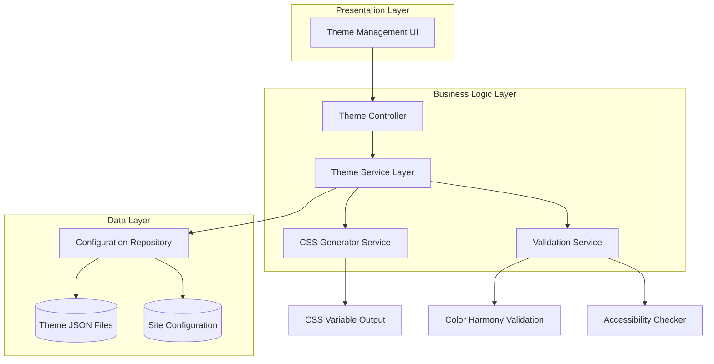
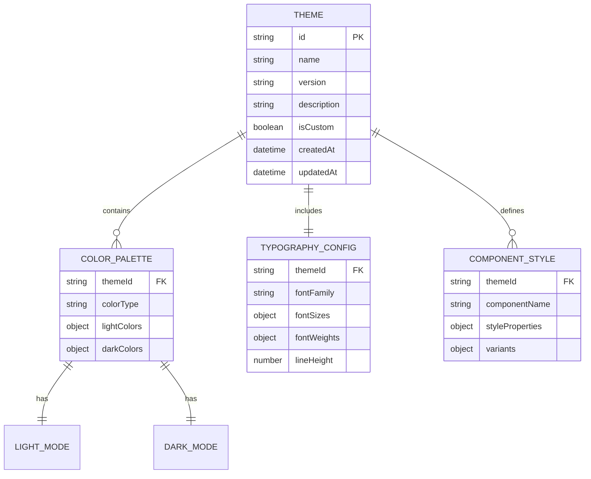

# Antler CMS Theming System - Technical Architecture Document

## 1. Architecture Design



## 2. Technology Description

- **Frontend**: React@18 + TypeScript + Tailwind CSS@3 + Astro@4
- **Theme Storage**: JSON configuration files + Site config integration
- **Styling Engine**: CSS Custom Properties + Tailwind CSS variable system
- **Color Processing**: chroma-js for color manipulation and validation
- **Admin Interface**: React components with real-time preview capabilities

## 3. Route Definitions

| Route | Purpose |
|-------|---------|
| /admin/themes | Main theme management interface with gallery and editor |
| /admin/themes/editor | Custom theme creation and editing interface |
| /admin/themes/preview | Full-screen theme preview modal |
| /api/themes | Theme configuration API endpoints |
| /api/themes/apply | Apply selected theme to site configuration |
| /api/themes/export | Export theme configuration as downloadable JSON |
| /api/themes/import | Import and validate theme configuration files |

## 4. API Definitions

### 4.1 Core Theme API

**Get Available Themes**
```
GET /api/themes
```

Response:
| Param Name | Param Type | Description |
|------------|------------|-------------|
| themes | Theme[] | Array of available theme configurations |
| activeTheme | string | ID of currently active theme |

**Apply Theme Configuration**
```
POST /api/themes/apply
```

Request:
| Param Name | Param Type | isRequired | Description |
|------------|------------|------------|-------------|
| themeId | string | true | Unique identifier for theme |
| customConfig | ThemeConfig | false | Custom theme configuration object |

Response:
| Param Name | Param Type | Description |
|------------|------------|-------------|
| success | boolean | Whether theme was applied successfully |
| cssVariables | object | Generated CSS custom properties |

**Export Theme Configuration**
```
GET /api/themes/export/:themeId
```

Response: JSON file download with complete theme configuration

**Import Theme Configuration**
```
POST /api/themes/import
```

Request:
| Param Name | Param Type | isRequired | Description |
|------------|------------|------------|-------------|
| themeFile | File | true | JSON theme configuration file |
| themeName | string | true | Display name for imported theme |

Example Theme Configuration:
```json
{
  "id": "ocean-blue",
  "name": "Ocean Blue",
  "version": "1.0.0",
  "colors": {
    "light": {
      "primary": {
        "50": "#eff6ff",
        "500": "#3b82f6",
        "900": "#1e3a8a"
      },
      "background": "#ffffff",
      "surface": "#f8fafc",
      "text": "#1e293b"
    },
    "dark": {
      "primary": {
        "50": "#1e3a8a",
        "500": "#60a5fa",
        "900": "#eff6ff"
      },
      "background": "#0f172a",
      "surface": "#1e293b",
      "text": "#f1f5f9"
    }
  },
  "typography": {
    "fontFamily": "Inter",
    "fontSizes": {
      "xs": "0.75rem",
      "sm": "0.875rem",
      "base": "1rem",
      "lg": "1.125rem",
      "xl": "1.25rem"
    }
  }
}
```

## 5. Server Architecture Diagram



## 6. Data Model

### 6.1 Data Model Definition



### 6.2 Data Definition Language

**Theme Configuration Schema**
```typescript
interface ThemeConfig {
  id: string;
  name: string;
  version: string;
  description?: string;
  isCustom: boolean;
  colors: {
    light: ColorScheme;
    dark: ColorScheme;
  };
  typography: TypographyConfig;
  components?: ComponentStyles;
  createdAt: string;
  updatedAt: string;
}

interface ColorScheme {
  primary: ColorScale;
  secondary: ColorScale;
  accent: ColorScale;
  neutral: ColorScale;
  background: string;
  surface: string;
  text: string;
  textMuted: string;
  border: string;
  success: string;
  warning: string;
  error: string;
  info: string;
}

interface ColorScale {
  50: string;
  100: string;
  200: string;
  300: string;
  400: string;
  500: string;  // Base color
  600: string;
  700: string;
  800: string;
  900: string;
}

interface TypographyConfig {
  fontFamily: string;
  fontSizes: {
    xs: string;
    sm: string;
    base: string;
    lg: string;
    xl: string;
    '2xl': string;
    '3xl': string;
    '4xl': string;
  };
  fontWeights: {
    light: number;
    normal: number;
    medium: number;
    semibold: number;
    bold: number;
  };
  lineHeight: {
    tight: number;
    normal: number;
    relaxed: number;
  };
}
```

**Pre-built Theme Definitions**
```json
// themes/ocean-blue.json
{
  "id": "ocean-blue",
  "name": "Ocean Blue",
  "version": "1.0.0",
  "description": "Calming blue tones inspired by ocean depths",
  "isCustom": false,
  "colors": {
    "light": {
      "primary": {
        "50": "#eff6ff",
        "100": "#dbeafe",
        "200": "#bfdbfe",
        "300": "#93c5fd",
        "400": "#60a5fa",
        "500": "#3b82f6",
        "600": "#2563eb",
        "700": "#1d4ed8",
        "800": "#1e40af",
        "900": "#1e3a8a"
      },
      "background": "#ffffff",
      "surface": "#f8fafc",
      "text": "#1e293b"
    },
    "dark": {
      "primary": {
        "50": "#1e3a8a",
        "100": "#1e40af",
        "200": "#1d4ed8",
        "300": "#2563eb",
        "400": "#3b82f6",
        "500": "#60a5fa",
        "600": "#93c5fd",
        "700": "#bfdbfe",
        "800": "#dbeafe",
        "900": "#eff6ff"
      },
      "background": "#0f172a",
      "surface": "#1e293b",
      "text": "#f1f5f9"
    }
  }
}

// themes/forest-green.json
{
  "id": "forest-green",
  "name": "Forest Green",
  "version": "1.0.0",
  "description": "Natural green palette inspired by forest environments",
  "isCustom": false,
  "colors": {
    "light": {
      "primary": {
        "50": "#f0fdf4",
        "100": "#dcfce7",
        "200": "#bbf7d0",
        "300": "#86efac",
        "400": "#4ade80",
        "500": "#22c55e",
        "600": "#16a34a",
        "700": "#15803d",
        "800": "#166534",
        "900": "#14532d"
      },
      "background": "#ffffff",
      "surface": "#f9fafb",
      "text": "#111827"
    }
  }
}

// themes/sunset-orange.json
{
  "id": "sunset-orange",
  "name": "Sunset Orange",
  "version": "1.0.0",
  "description": "Warm orange and red tones reminiscent of sunset skies",
  "isCustom": false
}

// themes/purple-galaxy.json
{
  "id": "purple-galaxy",
  "name": "Purple Galaxy",
  "version": "1.0.0",
  "description": "Deep purple and violet colors inspired by cosmic themes",
  "isCustom": false
}

// themes/monochrome.json
{
  "id": "monochrome",
  "name": "Monochrome",
  "version": "1.0.0",
  "description": "Clean black and white design with subtle gray accents",
  "isCustom": false
}
```

**CSS Variable Generation System**
```css
/* Generated CSS variables based on active theme */
:root {
  /* Primary color scale */
  --color-primary-50: #{theme.colors.light.primary.50};
  --color-primary-100: #{theme.colors.light.primary.100};
  --color-primary-500: #{theme.colors.light.primary.500};
  --color-primary-900: #{theme.colors.light.primary.900};
  
  /* Semantic colors */
  --color-background: #{theme.colors.light.background};
  --color-surface: #{theme.colors.light.surface};
  --color-text: #{theme.colors.light.text};
  --color-border: #{theme.colors.light.border};
  
  /* Typography */
  --font-family-primary: #{theme.typography.fontFamily};
  --font-size-base: #{theme.typography.fontSizes.base};
}

[data-theme="dark"] {
  /* Dark mode overrides */
  --color-primary-50: #{theme.colors.dark.primary.50};
  --color-primary-500: #{theme.colors.dark.primary.500};
  --color-background: #{theme.colors.dark.background};
  --color-text: #{theme.colors.dark.text};
}
```

**Integration with Tailwind Configuration**
```javascript
// Dynamic Tailwind config generation
const generateTailwindConfig = (activeTheme) => ({
  theme: {
    extend: {
      colors: {
        primary: activeTheme.colors.light.primary,
        background: 'var(--color-background)',
        surface: 'var(--color-surface)',
        text: 'var(--color-text)'
      },
      fontFamily: {
        sans: [activeTheme.typography.fontFamily, 'system-ui', 'sans-serif']
      }
    }
  }
});
```