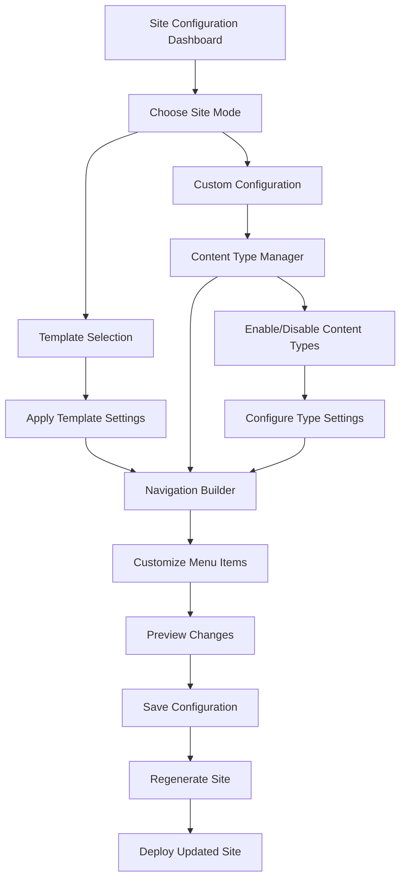

# Configurable Content Types and Navigation - Product Requirements Document

## 1. Product Overview

A flexible configuration system that allows Antler users to customize which content types are enabled and how navigation is structured, enabling specialized site configurations like resume-only, blog-only, or portfolio-only sites without code modifications.

- **Problem to solve**: Currently, all content types (blog, projects, docs, resume, contact) are hardcoded and always visible, making the site feel bloated for users who only need specific functionality.
- **Target users**: Non-technical users, freelancers, job seekers, small businesses, and developers who want to deploy focused, single-purpose sites.
- **Market value**: Transforms Antler from a one-size-fits-all solution into a flexible platform that can serve multiple use cases, increasing adoption and user satisfaction.

## 2. Core Features

### 2.1 User Roles

| Role | Configuration Method | Core Permissions |
|------|---------------------|------------------|
| Site Owner | Direct config file editing or admin interface | Can enable/disable content types, customize navigation, modify site settings |
| Content Creator | Admin interface only | Can create content within enabled content types, cannot modify site structure |

### 2.2 Feature Module

Our configurable content system consists of the following main components:

1. **Site Configuration Page**: Central dashboard for enabling/disabling content types and customizing navigation
2. **Navigation Builder**: Drag-and-drop interface for reordering menu items and customizing labels
3. **Content Type Manager**: Toggle switches and settings for each content type (blog, projects, docs, resume, contact)
4. **Site Mode Templates**: Pre-configured templates for common use cases (resume-only, portfolio, blog, documentation)
5. **Configuration Preview**: Live preview of navigation and site structure changes

### 2.3 Page Details

| Page Name | Module Name | Feature description |
|-----------|-------------|---------------------|
| Site Configuration | Content Type Toggles | Enable/disable individual content types with toggle switches. Show/hide associated navigation items automatically. |
| Site Configuration | Navigation Builder | Drag-and-drop interface to reorder navigation items. Edit navigation labels and URLs. Add custom navigation items. |
| Site Configuration | Site Mode Templates | Quick-apply templates for common configurations (Resume Site, Portfolio Site, Blog Site, Documentation Site, Full Site). |
| Site Configuration | Live Preview Panel | Real-time preview of navigation changes. Visual representation of enabled content types. |
| Navigation Builder | Menu Item Editor | Edit navigation labels, URLs, and visibility. Set custom icons for navigation items. Configure dropdown menus for grouped content. |
| Navigation Builder | Custom Links Manager | Add external links to navigation. Create custom internal pages. Set link targets and behaviors. |
| Content Type Manager | Individual Type Settings | Configure specific settings for each content type. Set default templates and schemas. Manage content type permissions. |
| Configuration Preview | Site Structure View | Visual tree view of site structure. Preview navigation on different screen sizes. Test navigation functionality. |

## 3. Core Process

### Site Owner Configuration Flow
1. **Access Configuration**: Navigate to admin interface or edit config file
2. **Choose Site Mode**: Select from pre-built templates or create custom configuration
3. **Configure Content Types**: Enable/disable specific content types using toggle switches
4. **Customize Navigation**: Use drag-and-drop builder to arrange menu items and edit labels
5. **Preview Changes**: Review navigation and site structure in live preview
6. **Apply Configuration**: Save changes and regenerate site structure
7. **Deploy**: Push changes to production with updated navigation and routing

### Content Creator Workflow
1. **Access Admin**: Log into admin interface with enabled content types visible
2. **Create Content**: Work within available content types only
3. **Preview Content**: See content within configured site structure
4. **Publish**: Content appears in navigation according to site configuration

## 4. User Interface Design

### 4.1 Design Style

- **Primary colors**: Blue (#3B82F6) for active states, Green (#10B981) for enabled features
- **Secondary colors**: Gray (#6B7280) for disabled states, Red (#EF4444) for warnings
- **Button style**: Rounded corners (8px), subtle shadows, hover animations
- **Font**: Inter or system fonts, 14px base size, 16px for headings
- **Layout style**: Card-based design with clear sections, left sidebar navigation for admin
- **Icons**: Heroicons or Lucide icons for consistency, toggle switches for enable/disable actions

### 4.2 Page Design Overview

| Page Name | Module Name | UI Elements |
|-----------|-------------|-------------|
| Site Configuration | Main Dashboard | Clean card layout with toggle switches for each content type. Color-coded status indicators (green=enabled, gray=disabled). Quick stats showing enabled features count. |
| Site Configuration | Site Mode Templates | Grid of template cards with preview thumbnails. Each card shows template name, description, and "Apply" button. Visual indicators of what content types each template enables. |
| Navigation Builder | Drag-and-Drop Interface | Sortable list with drag handles, inline editing for labels. Visual hierarchy with indentation for dropdown items. Real-time preview panel on the right side. |
| Navigation Builder | Menu Item Editor | Modal or slide-out panel with form fields for URL, label, icon selection. Toggle for external links, dropdown for link targets. Color picker for custom styling. |
| Content Type Manager | Toggle Grid | Grid layout with large toggle switches for each content type. Expandable sections showing type-specific settings. Usage statistics and content counts for each type. |
| Configuration Preview | Live Preview | Split-screen layout with configuration on left, preview on right. Responsive preview with device size toggles. Interactive navigation testing within preview. |

### 4.3 Responsiveness

Desktop-first design with mobile-adaptive interface. Touch-optimized drag-and-drop for tablet users. Collapsible sidebar navigation on smaller screens. Simplified configuration flow for mobile devices with step-by-step wizard approach.