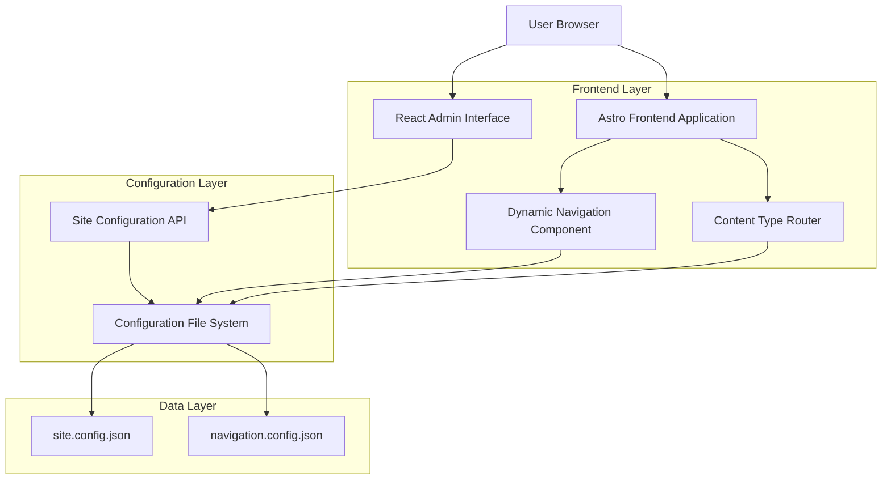
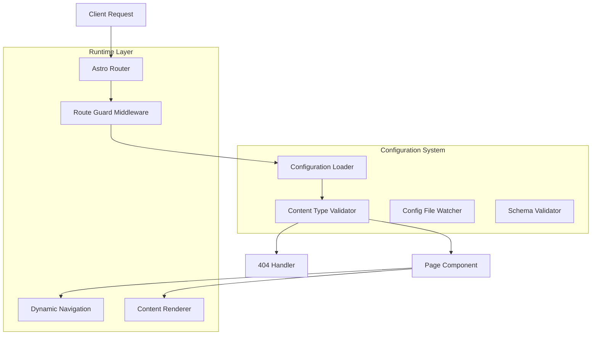
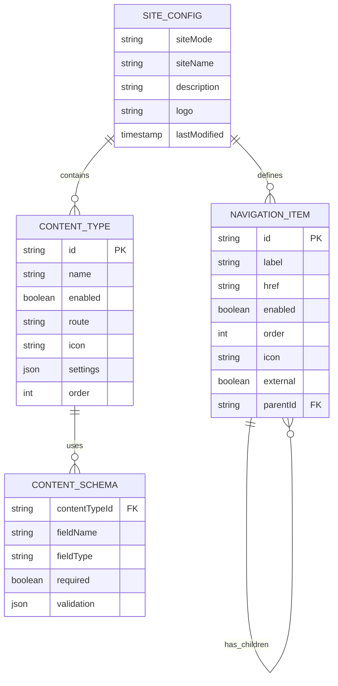

# Configurable Content Types and Navigation - Technical Architecture Document

## 1. Architecture Design



## 2. Technology Description

- Frontend: React@18 + Astro@4 + TypeScript + Tailwind CSS@3 + Vite
- Configuration: JSON-based config files with Zod validation
- State Management: React Context for admin interface, Astro global state for site config
- Build System: Custom Astro integration for dynamic routing based on configuration

## 3. Route Definitions

| Route | Purpose | Conditional |
|-------|---------|-------------|
| / | Home page with enabled content sections | Always available |
| /admin/config | Site configuration dashboard | Admin only |
| /admin/config/navigation | Navigation builder interface | Admin only |
| /admin/config/content-types | Content type management | Admin only |
| /blog | Blog listing page | Only if blog content type enabled |
| /blog/[slug] | Individual blog posts | Only if blog content type enabled |
| /projects | Projects listing page | Only if projects content type enabled |
| /projects/[slug] | Individual project pages | Only if projects content type enabled |
| /docs | Documentation index | Only if docs content type enabled |
| /docs/[...slug] | Documentation pages | Only if docs content type enabled |
| /resume | Resume page | Only if resume content type enabled |
| /contact | Contact form page | Only if contact content type enabled |

## 4. API Definitions

### 4.1 Configuration API

Site configuration management
```
GET /api/config/site
```

Response:
| Param Name | Param Type | Description |
|-----------|-------------|-------------|
| contentTypes | ContentTypeConfig[] | Array of content type configurations |
| navigation | NavigationItem[] | Navigation structure configuration |
| siteMode | string | Current site mode (full, resume, blog, portfolio, docs) |

```
POST /api/config/site
```

Request:
| Param Name | Param Type | isRequired | Description |
|-----------|-------------|-------------|-------------|
| contentTypes | ContentTypeConfig[] | true | Updated content type settings |
| navigation | NavigationItem[] | true | Updated navigation structure |
| siteMode | string | false | Site mode template to apply |

Navigation configuration
```
GET /api/config/navigation
```

Response:
| Param Name | Param Type | Description |
|-----------|-------------|-------------|
| items | NavigationItem[] | Ordered array of navigation items |
| customLinks | CustomLink[] | User-defined custom navigation links |

```
POST /api/config/navigation
```

Request:
| Param Name | Param Type | isRequired | Description |
|-----------|-------------|-------------|-------------|
| items | NavigationItem[] | true | Reordered navigation items |
| customLinks | CustomLink[] | false | Custom navigation links |

### 4.2 Type Definitions

```typescript
interface ContentTypeConfig {
  id: string;
  name: string;
  enabled: boolean;
  route: string;
  icon?: string;
  settings?: Record<string, any>;
}

interface NavigationItem {
  id: string;
  label: string;
  href: string;
  enabled: boolean;
  order: number;
  icon?: string;
  external?: boolean;
  children?: NavigationItem[];
}

interface SiteConfig {
  contentTypes: ContentTypeConfig[];
  navigation: NavigationItem[];
  siteMode: 'full' | 'resume' | 'blog' | 'portfolio' | 'docs' | 'custom';
  customization: {
    siteName: string;
    description: string;
    logo?: string;
  };
}
```

## 5. Server Architecture Diagram



## 6. Data Model

### 6.1 Data Model Definition



### 6.2 Configuration Files

Site Configuration (site.config.json)
```json
{
  "siteMode": "full",
  "siteName": "My Antler Site",
  "description": "A customizable static site",
  "contentTypes": [
    {
      "id": "blog",
      "name": "Blog",
      "enabled": true,
      "route": "/blog",
      "icon": "document-text",
      "order": 1,
      "settings": {
        "postsPerPage": 10,
        "showExcerpts": true
      }
    },
    {
      "id": "projects",
      "name": "Projects",
      "enabled": true,
      "route": "/projects",
      "icon": "briefcase",
      "order": 2
    },
    {
      "id": "resume",
      "name": "Resume",
      "enabled": true,
      "route": "/resume",
      "icon": "user",
      "order": 3
    },
    {
      "id": "docs",
      "name": "Documentation",
      "enabled": false,
      "route": "/docs",
      "icon": "book-open",
      "order": 4
    },
    {
      "id": "contact",
      "name": "Contact",
      "enabled": true,
      "route": "/contact",
      "icon": "mail",
      "order": 5
    }
  ],
  "navigation": [
    {
      "id": "home",
      "label": "Home",
      "href": "/",
      "enabled": true,
      "order": 0,
      "icon": "home"
    },
    {
      "id": "blog",
      "label": "Blog",
      "href": "/blog",
      "enabled": true,
      "order": 1,
      "icon": "document-text"
    },
    {
      "id": "projects",
      "label": "Projects",
      "href": "/projects",
      "enabled": true,
      "order": 2,
      "icon": "briefcase"
    },
    {
      "id": "resume",
      "label": "Resume",
      "href": "/resume",
      "enabled": true,
      "order": 3,
      "icon": "user"
    },
    {
      "id": "contact",
      "label": "Contact",
      "href": "/contact",
      "enabled": true,
      "order": 4,
      "icon": "mail"
    }
  ],
  "customLinks": [],
  "lastModified": "2024-01-15T10:30:00Z"
}
```

Site Mode Templates (templates/resume-only.json)
```json
{
  "name": "Resume Site",
  "description": "Perfect for job seekers and professionals",
  "siteMode": "resume",
  "contentTypes": [
    {
      "id": "resume",
      "enabled": true
    },
    {
      "id": "contact",
      "enabled": true
    },
    {
      "id": "blog",
      "enabled": false
    },
    {
      "id": "projects",
      "enabled": false
    },
    {
      "id": "docs",
      "enabled": false
    }
  ],
  "navigation": [
    {
      "id": "home",
      "label": "Home",
      "enabled": true,
      "order": 0
    },
    {
      "id": "resume",
      "label": "Resume",
      "enabled": true,
      "order": 1
    },
    {
      "id": "contact",
      "label": "Contact",
      "enabled": true,
      "order": 2
    }
  ]
}
```