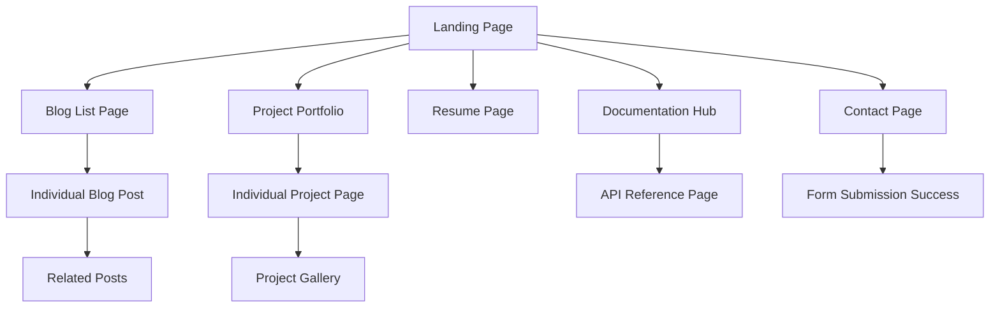

# Product Requirements Document: Antler - Markdown Content Management System

## 1. Product Overview
A modern, high-performance static site generator built with Astro that transforms Markdown files with YAML frontmatter into complete, pre-rendered websites. The system is designed for developers who want fast, secure, and maintainable websites without database complexity.

The product solves the problem of complex content management by using human-readable files organized in Astro's content collections (`src/content/`), while still providing dynamic functionality through serverless architecture. Target users include developers, bloggers, portfolio creators, and documentation teams who value performance and simplicity.

This system leverages Astro's content collections feature for type-safe content management, providing automatic validation, optimized builds, and excellent developer experience with TypeScript integration.

## 2. Core Features

### 2.1 User Roles
| Role | Registration Method | Core Permissions |
|------|---------------------|------------------|
| Content Creator | File system access | Can create and edit Markdown files in src/content/ collections, manage content structure following TypeScript schemas |
| Developer | Repository access | Can modify templates in src/components/, layouts in src/layouts/, styling, and deployment configuration |
| Site Visitor | No registration | Can browse published content, submit forms, interact with dynamic elements |

### 2.2 Feature Module
Our Antler system consists of the following main pages, built with Astro's file-based routing in src/pages/:

1. **Landing Page**: hero section, featured posts component, featured projects component, contact form
2. **Blog List Page**: article grid/list, pagination, tag filtering, search functionality
3. **Blog Post Page**: article content, metadata display, navigation between posts, comment system
4. **Project Portfolio Page**: project grid, technology tags, filtering by category
5. **Individual Project Page**: project details, image gallery, technology stack, GitHub links
6. **Resume Page**: professional summary, experience timeline, skills section, contact information
7. **Documentation Hub**: documentation navigation, search, category organization
8. **API Reference Page**: interactive API explorer, endpoint documentation, code examples
9. **Contact Page**: contact form, social links, location information

### 2.3 Page Details
| Page Name | Module Name | Feature description |
|-----------|-------------|---------------------|
| Landing Page | Hero Section | Display main heading, subheading, call-to-action buttons with smooth animations |
| Landing Page | Featured Posts | Automatically query and display latest 3 blog posts with thumbnails and excerpts |
| Landing Page | Featured Projects | Display curated project list based on YAML frontmatter configuration |
| Landing Page | Contact Form | Interactive form with validation, serverless submission, success/error feedback |
| Blog List Page | Article Grid | Display blog posts in responsive grid with pagination and infinite scroll |
| Blog List Page | Tag Filter | Filter posts by tags with dynamic URL updates and search functionality |
| Blog Post Page | Article Content | Render Markdown content with syntax highlighting and responsive typography |
| Blog Post Page | Post Navigation | Previous/next post navigation with smooth page transitions |
| Blog Post Page | Metadata Display | Show publication date, tags, reading time, author information |
| Project Portfolio | Project Grid | Responsive grid layout with hover effects and technology tag filtering |
| Individual Project | Project Details | Display project name, description, images, technology stack, links |
| Individual Project | Image Gallery | Interactive image carousel with lightbox functionality |
| Resume Page | Experience Timeline | Chronological work experience with expandable details |
| Resume Page | Skills Section | Categorized skills with proficiency indicators |
| Resume Page | Contact Info | Professional contact information with social media links |
| Documentation Hub | Navigation Tree | Hierarchical documentation structure with search and breadcrumbs |
| Documentation Hub | Content Search | Full-text search across all documentation pages |
| API Reference | Interactive Explorer | Live API testing interface with request/response examples |
| API Reference | Endpoint Documentation | Detailed API endpoint descriptions with parameter specifications |
| Contact Page | Form Handler | Contact form with validation, spam protection, email notifications |

## 3. Core Process

**Content Creator Flow:**
1. Create Markdown files in appropriate content directories (src/content/blog/, src/content/projects/, src/content/docs/)
2. Add YAML frontmatter with required metadata (title, date, tags, etc.)
3. Write content in Markdown format following the schema defined in src/content/config.ts
4. Commit changes to trigger automatic build and deployment

**Developer Flow:**
1. Set up project structure with Astro framework following best practices (src/content/ for collections)
2. Create component templates in src/components/ for different content types
3. Configure content collection schemas in src/content/config.ts
4. Configure build process and deployment pipeline
5. Customize styling and theming using Tailwind CSS
6. Implement serverless functions for dynamic features using Supabase

**Site Visitor Flow:**
1. Browse landing page and navigate to different sections
2. Read blog posts and project details
3. Use search and filtering functionality
4. Submit contact forms and interact with dynamic elements

## 4. User Interface Design

### 4.1 Design Style
- **Primary Colors**: Deep blue (#1e40af) for headers and CTAs, light blue (#3b82f6) for accents
- **Secondary Colors**: Gray scale (#f8fafc to #1e293b) for backgrounds and text
- **Button Style**: Rounded corners (8px), subtle shadows, hover animations with color transitions
- **Typography**: Inter font family, 16px base size, 1.6 line height for readability
- **Layout Style**: Card-based design with clean spacing, top navigation with mobile hamburger menu
- **Icons**: Heroicons for consistency, subtle animations on hover, phosphor icons for technical elements

### 4.2 Page Design Overview
| Page Name | Module Name | UI Elements |
|-----------|-------------|-------------|
| Landing Page | Hero Section | Full-width background gradient, centered content, animated call-to-action buttons, smooth scroll indicators |
| Landing Page | Featured Posts | Card grid layout, hover effects with scale transform, thumbnail images, excerpt text with fade-in animations |
| Blog List Page | Article Grid | Masonry layout for varied content heights, tag pills with color coding, pagination with smooth transitions |
| Blog Post Page | Article Content | Typography-focused design, code syntax highlighting, responsive images, reading progress indicator |
| Project Portfolio | Project Grid | Hover overlay effects, technology tag badges, responsive grid with CSS Grid, filter animation transitions |
| Resume Page | Experience Timeline | Vertical timeline with connecting lines, expandable sections, professional color scheme |
| Documentation Hub | Navigation Tree | Collapsible sidebar, breadcrumb navigation, search highlight functionality |
| Contact Page | Contact Form | Clean form design, real-time validation feedback, success animations, error state handling |

### 4.3 Responsiveness
Desktop-first approach with mobile-adaptive breakpoints at 768px and 1024px. Touch interaction optimization for mobile devices including larger tap targets, swipe gestures for image galleries, and optimized form inputs. Dark mode support with automatic system preference detection and manual toggle option.
