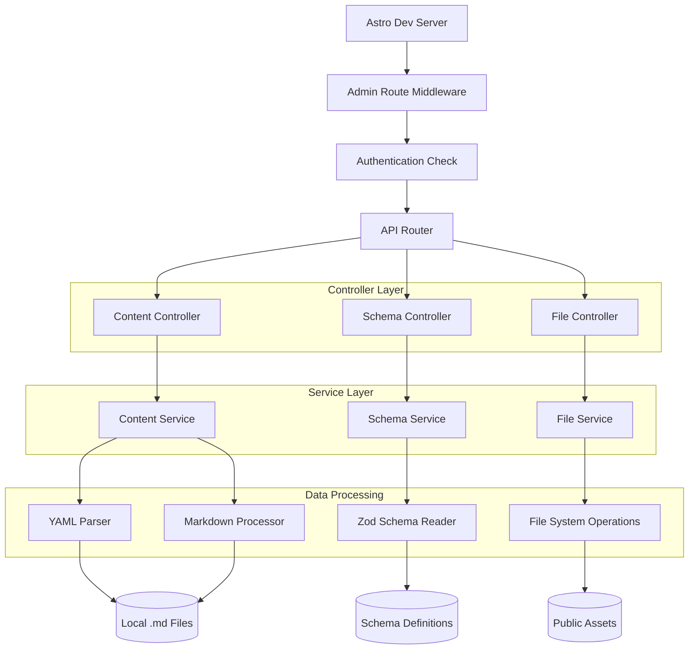
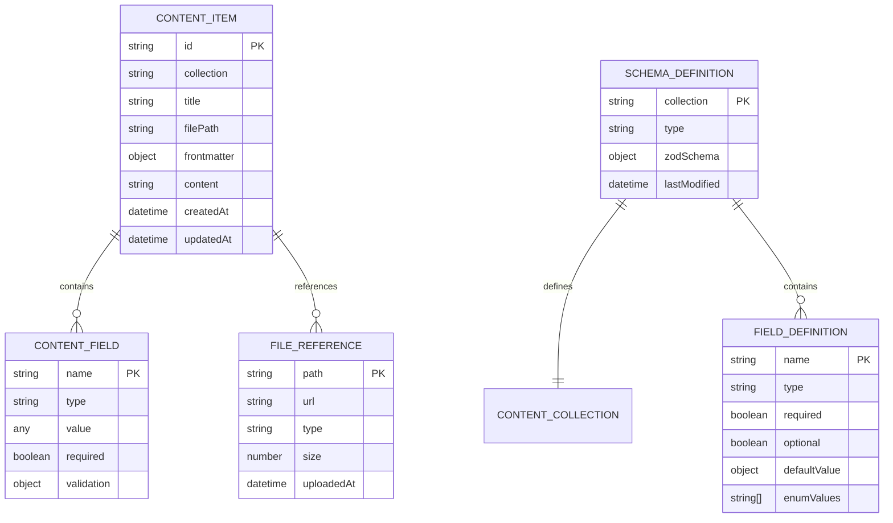

# Schema-Aware Content Editor - Technical Architecture Document

## 1. Architecture Design

```mermaid
graph TD
  A[User Browser] --> B[Astro Dev Server]
  B --> C[/__admin Route Handler]
  C --> D[React Admin Interface]
  D --> E[Schema Parser Service]
  D --> F[Content Manager Service]
  D --> G[File System API]
  
  E --> H[Zod Schema Reader]
  F --> I[YAML Parser/Generator]
  F --> J[Markdown Processor]
  G --> K[Local File System]
  
  subgraph "Frontend Layer (Development Only)"
    D
  end
  
  subgraph "Service Layer"
    E
    F
    G
  end
  
  subgraph "Data Layer"
    H
    I
    J
    K
  end
```

## 2. Technology Description

- Frontend: React@19 + TypeScript + Tailwind CSS + Framer Motion
- Backend: Astro API Routes (development server only)
- Content Processing: Zod schema parsing + gray-matter (YAML frontmatter) + unified/remark (Markdown)
- File Operations: Node.js fs module + chokidar (file watching)
- UI Components: Custom components + Lucide React icons
- Form Handling: React Hook Form + Zod validation

## 3. Route Definitions

| Route | Purpose |
|-------|---------|
| /__admin | Admin dashboard with content overview and navigation |
| /__admin/blog | Blog posts management interface with list and editor views |
| /__admin/projects | Projects management interface with grid/list views |
| /__admin/docs | Documentation management with hierarchical organization |
| /__admin/schema | Schema inspector for viewing content type definitions |
| /__admin/files | File manager for image uploads and media organization |
| /__admin/api/content | API endpoint for content CRUD operations |
| /__admin/api/schema | API endpoint for schema introspection |
| /__admin/api/files | API endpoint for file upload and management |

## 4. API Definitions

### 4.1 Core API

Content management operations
```
GET /__admin/api/content/:collection
```

Request:
| Param Name | Param Type | isRequired | Description |
|------------|------------|------------|-------------|
| collection | string | true | Content collection name (blog, projects, docs) |
| page | number | false | Page number for pagination |
| limit | number | false | Items per page (default: 20) |
| search | string | false | Search query for content filtering |

Response:
| Param Name | Param Type | Description |
|------------|------------|-------------|
| items | ContentItem[] | Array of content items with metadata |
| total | number | Total number of items |
| page | number | Current page number |
| hasMore | boolean | Whether more pages exist |

Example Response:
```json
{
  "items": [
    {
      "id": "building-with-astro",
      "title": "Building Lightning-Fast Sites with Astro",
      "description": "Discover how Astro's island architecture...",
      "publicationDate": "2024-01-25T00:00:00.000Z",
      "tags": ["Astro", "SSG", "Performance"],
      "featured": true,
      "filePath": "src/content/blog/building-with-astro.md"
    }
  ],
  "total": 15,
  "page": 1,
  "hasMore": true
}
```

Content creation and updates
```
POST /__admin/api/content/:collection
PUT /__admin/api/content/:collection/:id
```

Request:
| Param Name | Param Type | isRequired | Description |
|------------|------------|------------|-------------|
| frontmatter | object | true | YAML frontmatter data matching schema |
| content | string | true | Markdown content body |
| filename | string | false | Custom filename (auto-generated if not provided) |

Response:
| Param Name | Param Type | Description |
|------------|------------|-------------|
| success | boolean | Operation success status |
| id | string | Content item identifier |
| filePath | string | Generated file path |
| errors | string[] | Validation errors if any |

Schema introspection
```
GET /__admin/api/schema/:collection
```

Response:
| Param Name | Param Type | Description |
|------------|------------|-------------|
| schema | object | Zod schema definition with field types |
| fields | FieldDefinition[] | Parsed field definitions for form generation |
| relationships | object | Content relationships and references |

File management
```
POST /__admin/api/files/upload
DELETE /__admin/api/files/:path
```

Upload Request:
| Param Name | Param Type | isRequired | Description |
|------------|------------|------------|-------------|
| file | File | true | Image file to upload |
| directory | string | false | Target directory (default: images) |

Upload Response:
| Param Name | Param Type | Description |
|------------|------------|-------------|
| success | boolean | Upload success status |
| path | string | Generated file path |
| url | string | Public URL for the uploaded file |

## 5. Server Architecture Diagram



## 6. Data Model

### 6.1 Data Model Definition



### 6.2 Data Definition Language

Content Item Interface
```typescript
interface ContentItem {
  id: string;
  collection: 'blog' | 'projects' | 'docs';
  title: string;
  filePath: string;
  frontmatter: Record<string, any>;
  content: string;
  createdAt: Date;
  updatedAt: Date;
}

interface BlogPost extends ContentItem {
  collection: 'blog';
  frontmatter: {
    title: string;
    description: string;
    publicationDate: Date;
    featuredImage?: string;
    tags: string[];
    author?: string;
    readingTime?: number;
    featured?: boolean;
  };
}

interface Project extends ContentItem {
  collection: 'projects';
  frontmatter: {
    projectName: string;
    projectImage: string;
    description: string;
    technologies: string[];
    githubLink?: string;
    liveUrl?: string;
    featured?: boolean;
    createdAt?: Date;
  };
}

interface Documentation extends ContentItem {
  collection: 'docs';
  frontmatter: {
    title: string;
    description?: string;
    group: string;
    order: number;
  };
}
```

Schema Definition Interface
```typescript
interface SchemaDefinition {
  collection: string;
  type: 'content';
  zodSchema: z.ZodObject<any>;
  fields: FieldDefinition[];
  relationships: RelationshipDefinition[];
}

interface FieldDefinition {
  name: string;
  type: 'string' | 'number' | 'boolean' | 'date' | 'array' | 'object';
  required: boolean;
  optional: boolean;
  defaultValue?: any;
  enumValues?: string[];
  validation?: {
    min?: number;
    max?: number;
    pattern?: string;
    custom?: string;
  };
}

interface RelationshipDefinition {
  field: string;
  targetCollection: string;
  type: 'one-to-one' | 'one-to-many' | 'many-to-many';
  displayField: string;
}
```

File Management Interface
```typescript
interface FileReference {
  path: string;
  url: string;
  type: 'image' | 'document' | 'other';
  size: number;
  mimeType: string;
  uploadedAt: Date;
  usedBy: string[]; // Array of content item IDs using this file
}

interface UploadResult {
  success: boolean;
  path?: string;
  url?: string;
  error?: string;
}
```

API Response Types
```typescript
interface ApiResponse<T = any> {
  success: boolean;
  data?: T;
  error?: string;
  errors?: string[];
}

interface ContentListResponse {
  items: ContentItem[];
  total: number;
  page: number;
  limit: number;
  hasMore: boolean;
}

interface ValidationError {
  field: string;
  message: string;
  code: string;
}
```