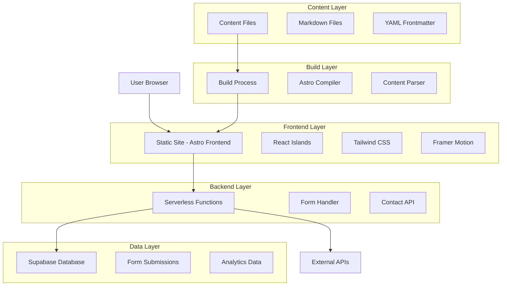
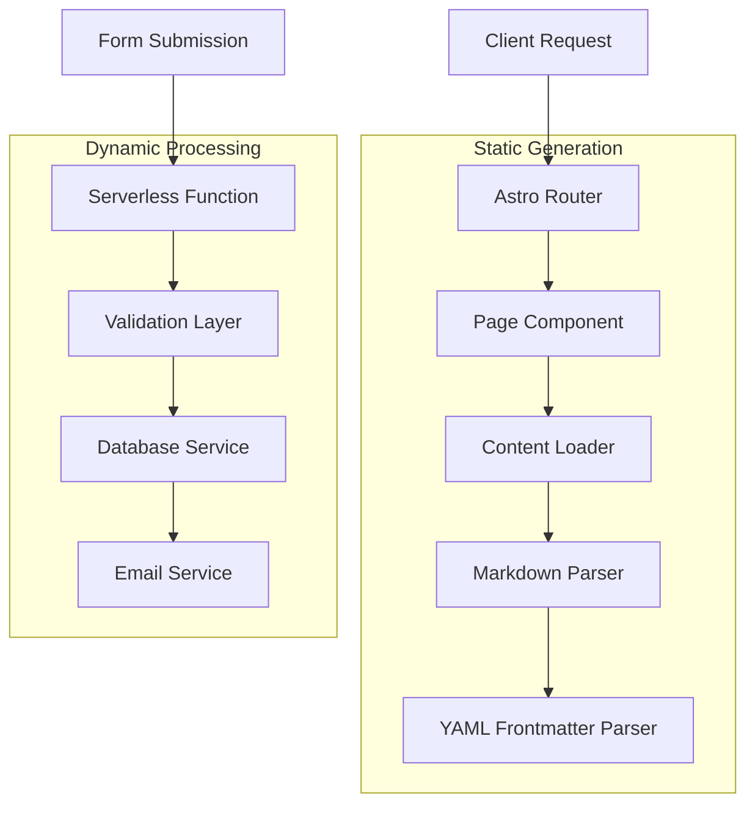
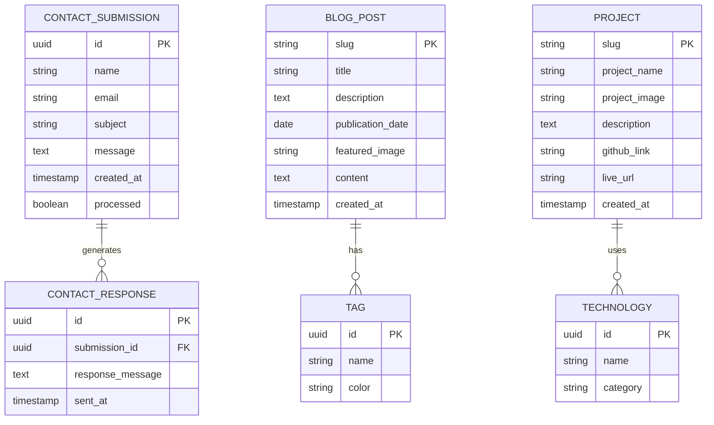

# Technical Architecture Document: Flat-File SSG Engine

## 1. Architecture Design



## 2. Technology Description

- **Frontend**: Astro@4 + React@18 + Tailwind CSS@3 + Framer Motion@10
- **Build Tool**: Vite (integrated with Astro)
- **Backend**: Supabase Edge Functions
- **Database**: Supabase (PostgreSQL)
- **Deployment**: Cloudflare Pages / Netlify / Vercel

## 3. Route Definitions

| Route | Purpose |
|-------|---------|
| / | Landing page with hero, featured posts, and projects |
| /blog | Blog list page with pagination and filtering |
| /blog/[slug] | Individual blog post pages |
| /projects | Project portfolio grid page |
| /projects/[slug] | Individual project detail pages |
| /resume | Professional resume page |
| /docs | Documentation hub with navigation |
| /docs/[...slug] | Nested documentation pages |
| /api-reference | API documentation with interactive explorer |
| /contact | Contact page with form |
| /api/contact | Serverless function for form submission |

## 4. API Definitions

### 4.1 Core API

Contact form submission
```
POST /api/contact
```

Request:
| Param Name | Param Type | isRequired | Description |
|------------|------------|------------|-------------|
| name | string | true | Contact person's full name |
| email | string | true | Valid email address |
| subject | string | true | Message subject line |
| message | string | true | Message content |

Response:
| Param Name | Param Type | Description |
|------------|------------|-------------|
| success | boolean | Submission status |
| message | string | Response message |

Example Request:
```json
{
  "name": "John Doe",
  "email": "john@example.com",
  "subject": "Project Inquiry",
  "message": "I'd like to discuss a potential collaboration."
}
```

Example Response:
```json
{
  "success": true,
  "message": "Thank you for your message. I'll get back to you soon!"
}
```

## 5. Server Architecture Diagram



## 6. Data Model

### 6.1 Data Model Definition



### 6.2 Data Definition Language

Contact Submissions Table
```sql
-- Create contact submissions table
CREATE TABLE contact_submissions (
    id UUID PRIMARY KEY DEFAULT gen_random_uuid(),
    name VARCHAR(255) NOT NULL,
    email VARCHAR(255) NOT NULL,
    subject VARCHAR(500) NOT NULL,
    message TEXT NOT NULL,
    created_at TIMESTAMP WITH TIME ZONE DEFAULT NOW(),
    processed BOOLEAN DEFAULT FALSE
);

-- Create indexes for performance
CREATE INDEX idx_contact_submissions_created_at ON contact_submissions(created_at DESC);
CREATE INDEX idx_contact_submissions_processed ON contact_submissions(processed);

-- Grant permissions
GRANT SELECT ON contact_submissions TO anon;
GRANT ALL PRIVILEGES ON contact_submissions TO authenticated;

-- Insert sample data
INSERT INTO contact_submissions (name, email, subject, message) VALUES
('John Doe', 'john@example.com', 'Project Inquiry', 'I would like to discuss a potential collaboration on a web development project.'),
('Jane Smith', 'jane@example.com', 'Technical Question', 'I have a question about the implementation of your SSG engine.');
```

Analytics Table (Optional)
```sql
-- Create analytics table for tracking
CREATE TABLE page_analytics (
    id UUID PRIMARY KEY DEFAULT gen_random_uuid(),
    page_path VARCHAR(500) NOT NULL,
    visitor_id VARCHAR(255),
    user_agent TEXT,
    referrer VARCHAR(500),
    created_at TIMESTAMP WITH TIME ZONE DEFAULT NOW()
);

-- Create indexes
CREATE INDEX idx_page_analytics_page_path ON page_analytics(page_path);
CREATE INDEX idx_page_analytics_created_at ON page_analytics(created_at DESC);

-- Grant permissions
GRANT INSERT ON page_analytics TO anon;
GRANT ALL PRIVILEGES ON page_analytics TO authenticated;
```

Content Metadata Table (For advanced features)
```sql
-- Create content metadata table
CREATE TABLE content_metadata (
    id UUID PRIMARY KEY DEFAULT gen_random_uuid(),
    content_type VARCHAR(50) NOT NULL, -- 'blog', 'project', 'docs'
    slug VARCHAR(255) NOT NULL,
    view_count INTEGER DEFAULT 0,
    like_count INTEGER DEFAULT 0,
    last_updated TIMESTAMP WITH TIME ZONE DEFAULT NOW(),
    UNIQUE(content_type, slug)
);

-- Create indexes
CREATE INDEX idx_content_metadata_type_slug ON content_metadata(content_type, slug);
CREATE INDEX idx_content_metadata_view_count ON content_metadata(view_count DESC);

-- Grant permissions
GRANT SELECT ON content_metadata TO anon;
GRANT ALL PRIVILEGES ON content_metadata TO authenticated;
```

## 7. File Structure

```
MdCms/
├── src/
│   ├── components/
│   │   ├── layout/
│   │   │   ├── Header.astro
│   │   │   ├── Footer.astro
│   │   │   └── Navigation.astro
│   │   ├── sections/
│   │   │   ├── Hero.astro
│   │   │   ├── FeaturedPosts.astro
│   │   │   └── FeaturedProjects.astro
│   │   ├── ui/
│   │   │   ├── Button.astro
│   │   │   ├── Card.astro
│   │   │   └── ContactForm.tsx
│   │   └── icons/
│   ├── layouts/
│   │   ├── BaseLayout.astro
│   │   ├── BlogPost.astro
│   │   ├── Project.astro
│   │   ├── Resume.astro
│   │   └── Documentation.astro
│   ├── pages/
│   │   ├── index.astro
│   │   ├── blog/
│   │   │   ├── index.astro
│   │   │   └── [slug].astro
│   │   ├── projects/
│   │   │   ├── index.astro
│   │   │   └── [slug].astro
│   │   ├── resume.astro
│   │   ├── contact.astro
│   │   └── api/
│   │       └── contact.ts
│   ├── styles/
│   │   └── global.css
│   └── utils/
│       ├── content.ts
│       └── theme.ts
├── content/
│   ├── blog/
│   ├── projects/
│   ├── docs/
│   └── config.ts
├── public/
│   ├── images/
│   └── favicon.ico
├── astro.config.mjs
├── tailwind.config.mjs
├── package.json
└── README.md
```

## 8. Build Process

1. **Content Discovery**: Astro scans the `content/` directory for Markdown files
2. **Frontmatter Parsing**: YAML frontmatter is extracted and validated
3. **Markdown Processing**: Content is converted to HTML with syntax highlighting
4. **Template Rendering**: Content is injected into appropriate Astro layouts
5. **Asset Optimization**: Images are optimized and CSS/JS is minified
6. **Static Generation**: All pages are pre-rendered to HTML files
7. **Deployment**: Generated files are deployed to CDN/hosting platform

## 9. Content Schema Definitions

### Blog Post Schema
```typescript
interface BlogPost {
  layout: 'BlogPost';
  title: string;
  description: string;
  publicationDate: string;
  featuredImage?: string;
  tags: string[];
  author?: string;
  readingTime?: number;
}
```

### Project Schema
```typescript
interface Project {
  layout: 'Project';
  projectName: string;
  projectImage: string;
  description: string;
  technologies: string[];
  githubLink?: string;
  liveUrl?: string;
  featured?: boolean;
}
```

### Landing Page Schema
```typescript
interface LandingPage {
  layout: 'Landing';
  title: string;
  sections: Array<{
    component: 'hero' | 'featured_posts' | 'featured_projects';
    [key: string]: any;
  }>;
}
```

## 10. Deployment Strategy

### Recommended: Cloudflare Pages
- **Static Hosting**: Global CDN with edge caching
- **Serverless Functions**: Cloudflare Workers for API endpoints
- **Build Integration**: Automatic builds from Git repository
- **Custom Domains**: Free SSL certificates and custom domain support

### Alternative: Netlify
- **Static Hosting**: Global CDN with instant cache invalidation
- **Serverless Functions**: Netlify Functions for backend logic
- **Form Handling**: Built-in form processing capabilities
- **Deploy Previews**: Automatic preview deployments for pull requests

### Environment Variables
```bash
# Supabase Configuration
SUPABASE_URL=your_supabase_url
SUPABASE_ANON_KEY=your_supabase_anon_key
SUPABASE_SERVICE_ROLE_KEY=your_service_role_key

# Email Configuration (optional)
SMTP_HOST=smtp.gmail.com
SMTP_PORT=587
SMTP_USER=your_email@gmail.com
SMTP_PASS=your_app_password
```