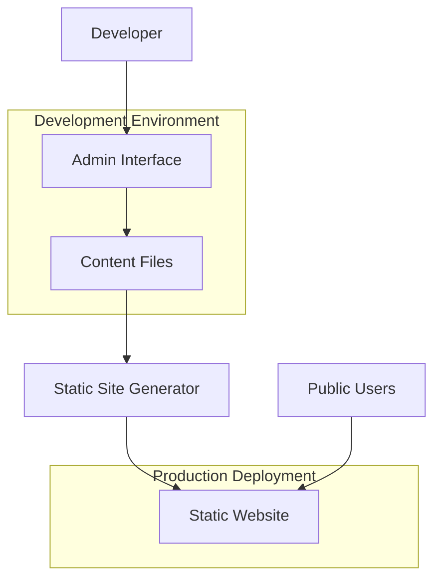

# Getting Started with Antler

Antler is a modern, dual-purpose static site generator that combines the power of Astro with an intuitive admin interface for content management. It provides the best of both worlds: lightning-fast static sites for production and a user-friendly CMS for development.

## What is Antler?

Antler provides two distinct but integrated experiences:

1. **Static Site Generator**: Builds fast, secure static websites from Markdown content using Astro
2. **Admin Interface**: A dynamic web-based content management system available during development

This dual approach gives you the performance and security of static sites for your public website, with the convenience of a modern CMS for content management.

## Key Features

### Static Site Features
- **Lightning Fast**: Pre-rendered static pages for optimal performance
- **SEO Optimized**: Built-in meta tags, structured data, and search engine optimization
- **Responsive Design**: Mobile-first design that works on all devices
- **Content Collections**: Organized content types (blog, projects, docs, resume)
- **Dark Mode**: Built-in theme switching with system preference detection
- **Contact Forms**: Integrated contact form with serverless deployment support

### Admin Interface Features
- **Visual Content Editor**: Rich editing experience with live preview
- **Schema-Aware Forms**: Dynamic forms based on content type schemas
- **File Management**: Upload and manage images and assets
- **Markdown Editor**: Advanced markdown editing with syntax highlighting
- **Content Dashboard**: Overview of all content with quick access
- **Multi-Content Types**: Manage blogs, projects, documentation, and resume sections

## Architecture Overview



## System Requirements

Before installing Antler, ensure your system meets these requirements:

### Required
- **Node.js**: Version 18.14.1 or higher
- **npm**: Version 9.0.0 or higher (comes with Node.js)
- **Git**: For version control and cloning repositories

### Recommended
- **VS Code**: With Astro extension for better development experience
- **Modern Browser**: Chrome, Firefox, Safari, or Edge for admin interface

### System Compatibility
- **Windows**: 10 or higher
- **macOS**: 10.15 (Catalina) or higher
- **Linux**: Ubuntu 18.04+, CentOS 7+, or equivalent

## Quick Installation

### Method 1: Clone Repository (Recommended)

1. **Clone the repository**:
   ```bash
   git clone https://github.com/your-username/antler.git
   cd antler
   ```

2. **Install dependencies**:
   ```bash
   npm install
   ```

3. **Start development server**:
   ```bash
   npm run dev
   ```

4. **Access the applications**:
   - **Public Site**: http://localhost:4321
   - **Admin Interface**: http://localhost:4321/admin

### Method 2: GitHub Template

1. Visit the [GitHub repository](https://github.com/your-username/antler)
2. Click **"Use this template"**
3. Create your new repository
4. Clone and follow steps 2-4 above

### Method 3: Download ZIP

1. Download the latest release from GitHub
2. Extract the ZIP file
3. Navigate to the extracted folder
4. Follow steps 2-4 from Method 1

## Initial Setup

### Environment Configuration

1. **Copy environment file**:
   ```bash
   cp .env.example .env
   ```

2. **Configure environment variables** (optional):
   ```env
   # Contact form configuration (optional)
   RESEND_API_KEY=your_resend_api_key
   CONTACT_EMAIL=your@email.com
   FROM_EMAIL=noreply@yourdomain.com
   ```

### Content Setup

Antler comes with example content. You can start with these or replace them:

- **Blog Posts**: `src/content/blog/`
- **Projects**: `src/content/projects/`
- **Documentation**: `src/content/docs/`
- **Resume Sections**: `src/content/resume*/`

## Development Experience

Antler provides a dual-interface development experience:

### Public Site (http://localhost:4321)
- View your static site as visitors will see it
- Test responsive design and functionality
- Preview content changes in real-time
- Access all public pages and features

### Admin Interface (http://localhost:4321/admin)
- Create and edit content through forms
- Upload and manage images
- Preview content before publishing
- Manage all content types in one place

## First Steps

### 1. Explore the Admin Interface
- Navigate to http://localhost:4321/admin
- Browse the dashboard to see existing content
- Try editing a blog post or project
- Upload an image through the file manager

### 2. Create Your First Content
- Click "New Post" in the blog section
- Fill out the form with your content
- Use the markdown editor for rich formatting
- Preview your changes in real-time
- Save and view on the public site

### 3. Customize Your Site
- Edit content in `src/content/` directories
- Modify components in `src/components/`
- Update styling in `src/styles/`
- Configure site settings in `astro.config.mjs`

## Development vs Production

### Development Mode
- Admin interface is fully functional at `/admin`
- Hot reloading for both public site and admin interface
- All content types are editable through the admin
- File uploads and management available
- Full debugging and development tools

### Production Deployment
- Only the static site is deployed (admin interface excluded)
- All content is pre-rendered for optimal performance
- Admin functionality is not included in the build
- Content changes require rebuilding and redeploying
- Maximum security and performance

## Available Scripts

```bash
# Development
npm run dev          # Start development server with admin interface
npm run build        # Build static site for production
npm run preview      # Preview production build locally

# Utilities
npm run astro        # Run Astro CLI commands
npm run check        # Type check the project
npm run lint         # Lint code with ESLint
```

## Troubleshooting

### Common Issues

**Port 4321 already in use**
```bash
# Kill existing process
npx kill-port 4321
# Or use different port
npm run dev -- --port 3000
```

**Node.js version issues**
```bash
# Check Node.js version
node --version
# Update Node.js if needed
```

**Dependencies not installing**
```bash
# Clear npm cache
npm cache clean --force
# Delete node_modules and reinstall
rm -rf node_modules package-lock.json
npm install
```

**Admin interface not loading**
- Ensure development server is running
- Check browser console for errors
- Verify you're accessing http://localhost:4321/admin

## Next Steps

Now that Antler is installed and running, here's what to do next:

### Learn the Basics
- [Content Creation Guide](./content-creation-guide.md) - Learn how to create different types of content
- [Admin Interface Guide](./admin-interface-guide.md) - Master the admin interface
- [Building and Deployment Guide](./building-deployment-guide.md) - Deploy your site

### Customize Your Site
- [Customization and Theming Guide](./customization-theming-guide.md) - Customize appearance and functionality
- [API Reference Guide](./api-reference-guide.md) - Technical API documentation
- [Development Workflow Guide](./development-workflow-guide.md) - Best practices for development

### Get Help
- [Troubleshooting Guide](./troubleshooting-guide.md) - Common issues and solutions
- Check the documentation in `src/content/docs/`
- Review example content for reference

## Welcome to Antler!

**Congratulations!** 🎉 You now have Antler installed and running. The powerful combination of static site generation and an intuitive admin interface gives you the best of both worlds: developer-friendly workflows and content creator-friendly tools.

Start by exploring the admin interface, creating your first piece of content, and customizing the site to match your needs. Antler is designed to grow with you, from simple blogs to complex documentation sites and professional portfolios.