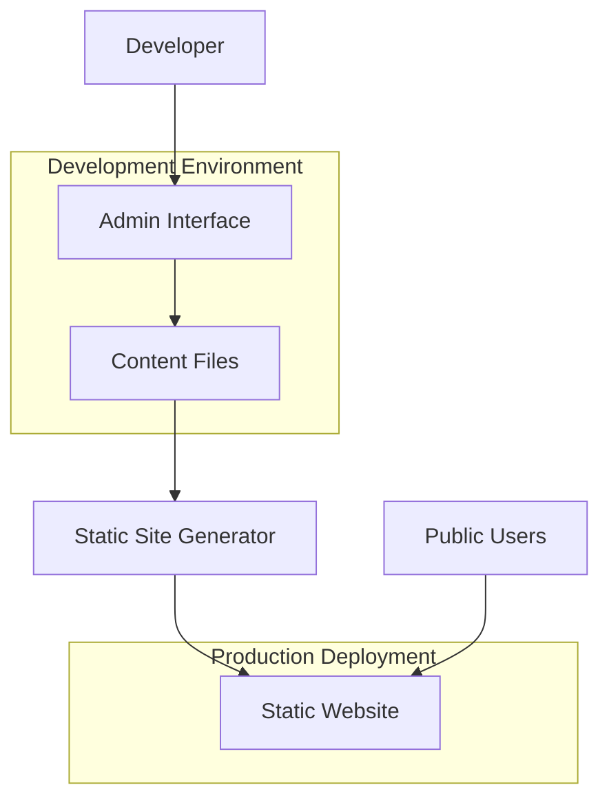

# Getting Started with Antler

Antler is a modern, dual-purpose content management system that combines the power of static site generation with a dynamic admin interface for content management.

## What is Antler?

Antler provides two distinct but integrated experiences:

1. **Static Site Generator**: Builds fast, secure static websites from Markdown content
2. **Admin Interface**: A dynamic web-based content management system for creating and editing content

This dual approach gives you the best of both worlds - the performance and security of static sites for your public website, with the convenience of a modern CMS for content management.

## Key Features

### Static Site Features
- **Lightning Fast**: Pre-rendered static pages for optimal performance
- **SEO Optimized**: Built-in meta tags, structured data, and search engine optimization
- **Responsive Design**: Mobile-first design that works on all devices
- **Content Collections**: Organized content types (blog, projects, docs, resume)
- **Dark Mode**: Built-in theme switching with system preference detection
- **Contact Forms**: Integrated contact form with multiple deployment options

### Admin Interface Features
- **Visual Content Editor**: Rich editing experience with live preview
- **Schema-Aware Forms**: Dynamic forms based on content type schemas
- **File Management**: Upload and manage images and assets
- **Markdown Editor**: Advanced markdown editing with syntax highlighting
- **Content Dashboard**: Overview of all content with quick access
- **Multi-Content Types**: Manage blogs, projects, documentation, and resume sections

## Architecture Overview



## Quick Start

### Prerequisites
- Node.js 18 or higher
- npm or yarn package manager

### Installation

1. **Clone the repository**:
   ```bash
   git clone <your-repo-url>
   cd Antler
   ```

2. **Install dependencies**:
   ```bash
   npm install
   ```

3. **Start development server**:
   ```bash
   npm run dev
   ```

4. **Access the applications**:
   - **Public Site**: http://localhost:4321
   - **Admin Interface**: http://localhost:4321/admin

### First Steps

1. **Explore the Admin Interface**:
   - Navigate to http://localhost:4321/admin
   - Browse the dashboard to see existing content
   - Try editing a blog post or project

2. **Create Your First Content**:
   - Click "New Post" in the blog section
   - Fill out the form with your content
   - Use the markdown editor for rich formatting
   - Preview your changes in real-time

3. **View Your Public Site**:
   - Navigate to http://localhost:4321
   - See your content displayed on the public site
   - Test the responsive design on different screen sizes

## Development vs Production

### Development Mode
- Admin interface is fully functional at `/admin`
- Hot reloading for both public site and admin interface
- All content types are editable through the admin
- File uploads and management available

### Production Deployment
- Only the static site is deployed (admin interface excluded)
- All content is pre-rendered for optimal performance
- Admin functionality is not included in the build
- Content changes require rebuilding and redeploying

## Next Steps

- [Content Creation Guide](./content-creation) - Learn how to create different types of content
- [Admin Interface Guide](./admin-interface) - Detailed guide to using the admin interface
- [Deployment Guide](./deployment) - How to deploy your static site
- [Customization Guide](./customization) - Customize the design and functionality

## Getting Help

- Check the [documentation](./docs) for detailed guides
- Review the [API reference](./api-reference) for technical details
- Look at example content in the `src/content/` directory